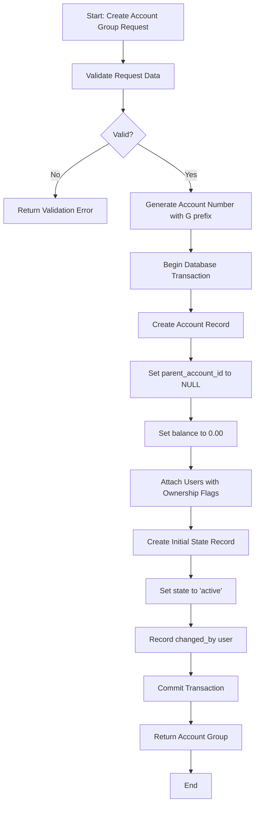
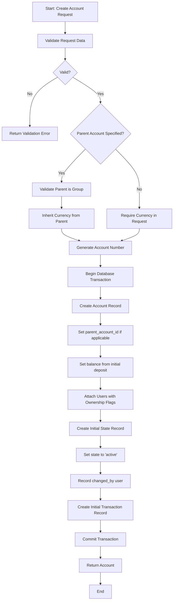
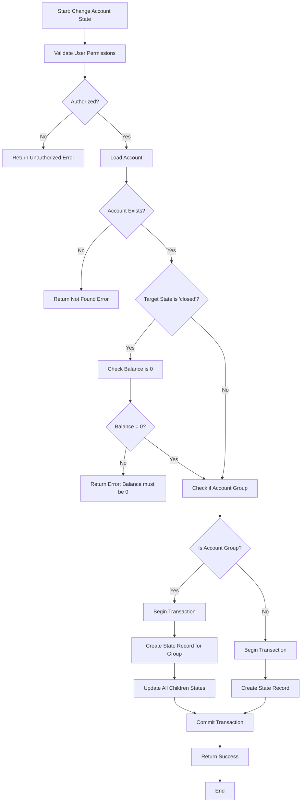
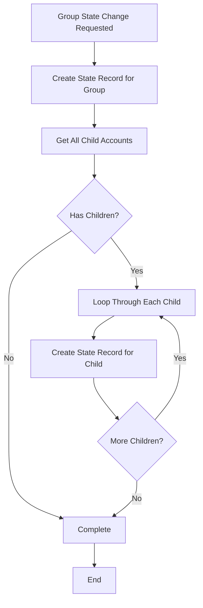

# Accounts Feature - Flow Documentation

## Overview

This document describes the workflows for account creation, state management, and account group operations in the banking system.

---

## Account Creation Flows

### Account Group Creation Flow

**Purpose:** Create a parent account that can contain multiple child accounts.

**Prerequisites:**

-   User must have role: Admin, Manager, or Teller
-   Account type must exist
-   Users to be assigned must exist
-   At least one owner user must be specified

**Flow Steps:**

**Required Data:**

-   `account_type_id`: Account type identifier
-   `currency`: 3-letter uppercase currency code (e.g., "USD")
-   `user_ids`: Array of user IDs to assign to account
-   `owner_user_id`: ID of the primary owner (must be in user_ids array)

**Account Number Format:** `G-AC-XXXXXXXXXX` (where X is zero-padded sequential number)

**Post-Creation:**

-   Account is created with balance 0.00
-   Initial state is set to "active"
-   Users are linked via `account_users` table
-   State change is logged in `account_states` table

---

### Individual Account (Leaf) Creation Flow

**Purpose:** Create a child account that belongs to an account group or stands alone.

**Prerequisites:**

-   User must have role: Admin, Manager, or Teller
-   Account type must exist
-   If parent account specified, it must exist and be a group (parent_account_id = NULL)
-   Users to be assigned must exist
-   Initial deposit amount must be specified

**Flow Steps:**

**Required Data:**

-   `account_type_id`: Account type identifier
-   `parent_account_id`: (Optional) Parent group account ID
-   `currency`: Required if no parent, otherwise inherited
-   `initial_deposit`: Starting balance amount (must be >= 0)
-   `user_ids`: Array of user IDs to assign to account
-   `owner_user_id`: ID of the primary owner

**Account Number Format:** `AC-XXXXXXXXXX` (standard format without G prefix)

**Post-Creation:**

-   Account is created with specified initial deposit as balance
-   If parent exists, currency is inherited automatically
-   Initial state is set to "active"
-   Initial deposit transaction is recorded (transaction system to be implemented)

---

## State Change Flow

### General State Change Flow

**Purpose:** Change the state of an account (active, frozen, suspended, closed).

**Authorized Roles:** Admin, Manager, Teller

**Available States:**

-   **active**: Normal operation, all operations allowed
-   **frozen**: Withdrawals, debit transfers, and modifications denied
-   **suspended**: View balance only, all other operations denied
-   **closed**: All operations denied, balance must be 0

**Flow Steps:**

**State Transition Rules:**

-   **No Restrictions**: Any state can transition to any other state
-   **Closing Validation**: Account balance must be exactly 0.00 before closing
-   **Group Cascade**: Changing a group's state automatically updates all children to the same state

**State Record:**

-   `account_id`: The account being changed
-   `state`: New state name (string)
-   `changed_by`: User ID who initiated the change
-   `created_at`: Timestamp of the change

---

### Account Group State Change (Cascade)

**Purpose:** When an account group's state changes, all child accounts must be updated.

**Flow Steps:**

**Important Notes:**

-   All child accounts receive the same state as the parent
-   Each state change is logged individually for audit trail
-   Operation is atomic (all or nothing via transaction)

---

## State-Based Operation Restrictions

### Active State

-   ✅ Deposit: Allowed
-   ✅ Withdraw: Allowed
-   ✅ Transfer: Allowed (both debit and credit)
-   ✅ View Balance: Allowed
-   ✅ Modify Account: Allowed

### Frozen State

-   ✅ Deposit: Allowed
-   ❌ Withdraw: Denied
-   ❌ Debit Transfer: Denied
-   ✅ Credit Transfer: Allowed (receiving)
-   ✅ View Balance: Allowed
-   ❌ Modify Account: Denied

### Suspended State

-   ❌ Deposit: Denied
-   ❌ Withdraw: Denied
-   ❌ Transfer: Denied
-   ✅ View Balance: Allowed
-   ❌ Modify Account: Denied

### Closed State

-   ❌ Deposit: Denied
-   ❌ Withdraw: Denied
-   ❌ Transfer: Denied
-   ❌ View Balance: Denied (or read-only for historical records)
-   ❌ Modify Account: Denied
-   ⚠️ **Requirement**: Balance must be 0.00 before closing

---

## Balance Calculation

### Leaf Account Balance

**Method:** Calculated from transaction records (transaction system to be implemented).

-   Starting balance: Initial deposit amount
-   Each transaction updates the balance
-   Balance = Sum of all transaction amounts

**Note:** Transaction system will track:

-   Deposits (positive amounts)
-   Withdrawals (negative amounts)
-   Transfers (debit/credit pairs)

### Group Account Balance

**Method:** Sum of all child account balances.

-   Group balance = SUM(child_accounts.balance)
-   Group's own balance field is typically 0.00
-   Calculated on-demand, not stored

**Example:**

-   Group Account: 0.00
-   Child Account 1: 1000.00
-   Child Account 2: 2500.00
-   Child Account 3: 500.00
-   **Group Balance = 4000.00**

---

## Feature Assignment Flow

**Purpose:** Assign features to accounts based on account type or manual assignment.

**Flow:**

1. Features are defined in `account_features` table
2. Account types may have default features
3. Features can be manually assigned/removed
4. Features are checked during operations to apply additional logic

**Example Features:**

-   Overdraft Protection: Allows negative balance
-   International Transfers: Enables cross-border transactions

---

## Account Hierarchy Rules

### Maximum Depth

-   **2 levels only**: Parent (Group) → Child (Leaf)
-   Child accounts cannot have children

### Account Group Rules

-   Must have `parent_account_id = NULL`
-   Can contain multiple child accounts
-   Balance is sum of children
-   State changes cascade to children

### Account Leaf Rules

-   Can have `parent_account_id` pointing to a group, or be standalone
-   If parent exists, currency is inherited
-   Balance calculated from transactions
-   State is independent unless parent state changes

---

## Audit Trail

### State Change History

All state changes are recorded in `account_states` table:

-   Timestamp of change
-   User who initiated change
-   Previous and new state (via history)
-   Account affected

### Account Creation

-   Created timestamp in `accounts.created_at`
-   Creator tracked via authenticated user at creation time

---

## Error Handling

### Common Errors

**Validation Errors:**

-   Invalid account type
-   Invalid currency code
-   Missing required fields
-   Invalid user IDs

**Business Logic Errors:**

-   Cannot close account with non-zero balance
-   Parent account must be a group
-   Maximum hierarchy depth exceeded
-   Duplicate account number

**Authorization Errors:**

-   User lacks required role
-   User not authorized for account

---

## Integration Points

### Future Integrations

**Transaction System:**

-   Leaf account balances calculated from transactions
-   Transaction history per account
-   Balance validation on operations

**Interest Calculation:**

-   Applied based on account type's `interest_strategy`
-   Calculated periodically based on balance

**Notification System:**

-   State change notifications to account owners
-   Balance threshold alerts
-   Account creation confirmations
