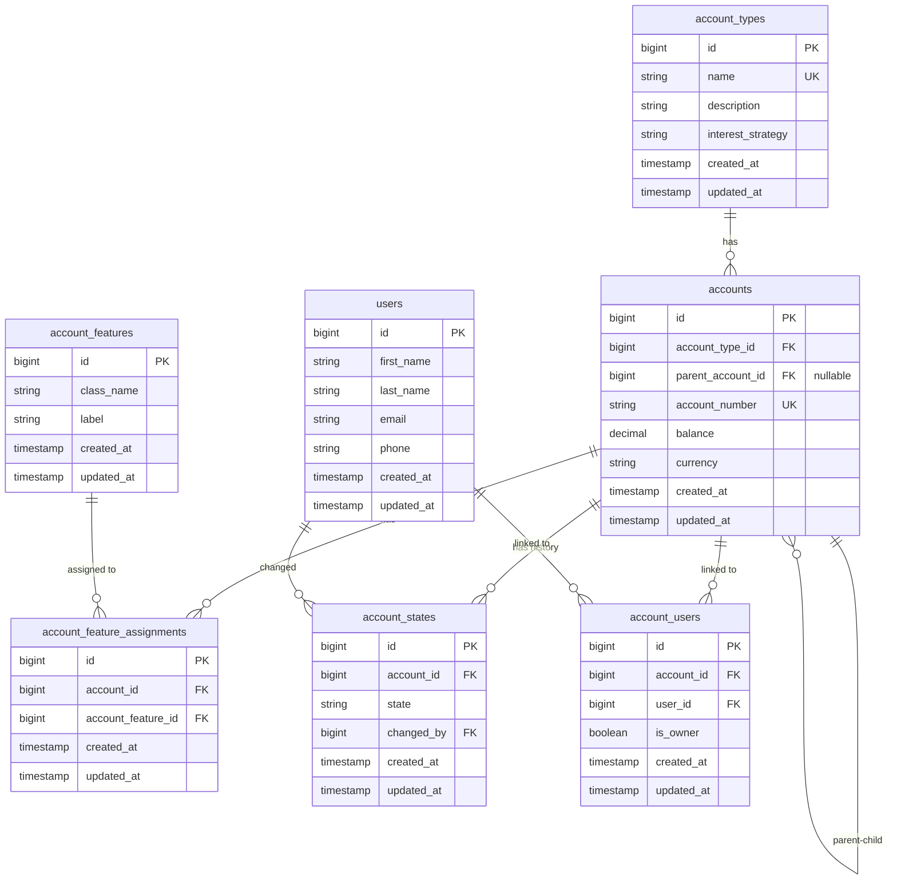

# Accounts Feature - Schema Documentation

## Overview

The Accounts feature implements a hierarchical account system using design patterns including Composite, State, Strategy, and Decorator Patterns. The system supports both **Account Groups** (parent accounts) and **Account Leaves** (individual/child accounts) with a maximum depth of 2 levels.

---

## Database Schema

### Entity Relationship Diagram

---

## Table Definitions

### 1. `account_types`

Stores the different types of accounts available in the system. Each account type defines behavior through an interest strategy.

| Column              | Type        | Constraints                 | Description                                                                                                                |
| ------------------- | ----------- | --------------------------- | -------------------------------------------------------------------------------------------------------------------------- |
| `id`                | bigint      | PRIMARY KEY, AUTO_INCREMENT | Unique identifier                                                                                                          |
| `name`              | string(255) | NOT NULL, UNIQUE            | Type name (e.g., "Savings", "Checking", "Business")                                                                        |
| `description`       | string(255) | NOT NULL                    | Human-readable description                                                                                                 |
| `interest_strategy` | string(255) | NULLABLE                    | Fully qualified class name of the interest calculation strategy (e.g., `App\Accounts\Strategies\SavingsInterestsStrategy`) |
| `created_at`        | timestamp   | NULLABLE                    | Record creation timestamp                                                                                                  |
| `updated_at`        | timestamp   | NULLABLE                    | Record last update timestamp                                                                                               |

**Common Account Types:**

-   **Savings Account**: Typically has interest calculated on balance
-   **Checking Account**: Standard transactional account, usually minimal or no interest
-   **Business Account**: For business entities, may have different fee structures
-   **Personal Account**: Standard personal banking account

**Example Data:**

-   name: "Savings"
-   description: "Personal savings account with interest"
-   interest_strategy: "App\Accounts\Strategies\SavingsInterestsStrategy"

---

### 2. `accounts`

The main accounts table storing both account groups (parent accounts) and individual accounts (leaf accounts).

| Column              | Type          | Constraints                                | Description                                                  |
| ------------------- | ------------- | ------------------------------------------ | ------------------------------------------------------------ |
| `id`                | bigint        | PRIMARY KEY, AUTO_INCREMENT                | Unique identifier                                            |
| `account_type_id`   | bigint        | FOREIGN KEY → `account_types.id`, NOT NULL | Reference to account type                                    |
| `parent_account_id` | bigint        | FOREIGN KEY → `accounts.id`, NULLABLE      | **NULL** for account groups, **NOT NULL** for child accounts |
| `account_number`    | string(255)   | NOT NULL, UNIQUE                           | Human-readable account identifier                            |
| `balance`           | decimal(10,2) | NOT NULL, DEFAULT 0.00                     | Account balance in the account's currency                    |
| `currency`          | string(3)     | NOT NULL                                   | ISO 4217 currency code (e.g., USD, EUR, GBP) - uppercase     |
| `created_at`        | timestamp     | NULLABLE                                   | Record creation timestamp                                    |
| `updated_at`        | timestamp     | NULLABLE                                   | Record last update timestamp                                 |

**Important Notes:**

-   **Account Groups**: Have `parent_account_id = NULL`. Account numbers should be prefixed with "G" (e.g., `G-AC-0000000001`)
-   **Account Leaves**: Have `parent_account_id` pointing to their parent group. Account numbers follow standard format (e.g., `AC-0000000002`)
-   **Balance Calculation**:
    -   **Leaf Accounts**: Balance is calculated from transactions (transactions table to be implemented)
    -   **Group Accounts**: Balance is the sum of all children accounts' balances (calculated, not stored)

**Example Account Group:**

-   parent_account_id: null
-   account_number: "G-AC-0000000001"
-   balance: 0.00
-   currency: "USD"

**Example Account Leaf:**

-   parent_account_id: 1 (points to parent group)
-   account_number: "AC-0000000002"
-   balance: 1000.00
-   currency: "USD" (inherited from parent if not specified)

---

### 3. `account_features`

Stores available account features that can be applied to accounts. Features define additional capabilities beyond basic account operations.

| Column       | Type        | Constraints                 | Description                                                                                                         |
| ------------ | ----------- | --------------------------- | ------------------------------------------------------------------------------------------------------------------- |
| `id`         | bigint      | PRIMARY KEY, AUTO_INCREMENT | Unique identifier                                                                                                   |
| `class_name` | string(255) | NOT NULL                    | Fully qualified class name implementing `AccountFeature` interface (e.g., `App\Accounts\Features\OverdraftFeature`) |
| `label`      | string(255) | NOT NULL                    | Human-readable feature name (e.g., "Overdraft Protection")                                                          |
| `created_at` | timestamp   | NULLABLE                    | Record creation timestamp                                                                                           |
| `updated_at` | timestamp   | NULLABLE                    | Record last update timestamp                                                                                        |

**Common Features:**

-   **Overdraft Protection**: Allows account to go below zero balance
-   **International Transfers**: Enables cross-border transactions
-   **Interest Bearing**: Account earns interest (may overlap with account type)

**Example:**

-   class_name: "App\Accounts\Features\OverdraftFeature"
-   label: "Overdraft Protection"

---

### 4. `account_feature_assignments`

Many-to-many relationship table linking accounts to their assigned features. Features are typically assigned based on account type, but can also be assigned manually.

| Column               | Type      | Constraints                                   | Description                  |
| -------------------- | --------- | --------------------------------------------- | ---------------------------- |
| `id`                 | bigint    | PRIMARY KEY, AUTO_INCREMENT                   | Unique identifier            |
| `account_id`         | bigint    | FOREIGN KEY → `accounts.id`, NOT NULL         | Reference to account         |
| `account_feature_id` | bigint    | FOREIGN KEY → `account_features.id`, NOT NULL | Reference to feature         |
| `created_at`         | timestamp | NULLABLE                                      | Record creation timestamp    |
| `updated_at`         | timestamp | NULLABLE                                      | Record last update timestamp |

**Unique Constraint:** (`account_id`, `account_feature_id`) - An account cannot have the same feature assigned twice.

---

### 5. `account_states`

Maintains a **history** of all state changes for each account. The current state is determined by the most recent record (highest `id` or `created_at`).

| Column       | Type        | Constraints                           | Description                                                     |
| ------------ | ----------- | ------------------------------------- | --------------------------------------------------------------- |
| `id`         | bigint      | PRIMARY KEY, AUTO_INCREMENT           | Unique identifier                                               |
| `account_id` | bigint      | FOREIGN KEY → `accounts.id`, NOT NULL | Reference to account                                            |
| `state`      | string(255) | NOT NULL                              | State name (e.g., "active", "frozen", "suspended", "closed")    |
| `changed_by` | bigint      | FOREIGN KEY → `users.id`, NOT NULL    | User who initiated the state change (Admin, Manager, or Teller) |
| `created_at` | timestamp   | NULLABLE                              | State change timestamp                                          |
| `updated_at` | timestamp   | NULLABLE                              | Record last update timestamp                                    |

**Available States:**

-   **active**: Normal operation, all operations allowed
-   **frozen**: Withdrawals, debit transfers, and modifications denied
-   **suspended**: View balance only, all other operations denied
-   **closed**: All operations denied, balance must be 0

**State Transition Rules:**

-   **No restrictions**: Any state can transition to any other state
-   **Closing Requirement**: Account balance must be 0 before closing
-   **Group State Changes**: When a group's state changes, all children automatically change to the same state

**Getting Current State:** Query the latest record by `created_at` or `id` for a given account_id.

---

### 6. `account_users`

Many-to-many relationship table linking accounts to users, defining account ownership and access permissions.

| Column       | Type      | Constraints                           | Description                                                       |
| ------------ | --------- | ------------------------------------- | ----------------------------------------------------------------- |
| `id`         | bigint    | PRIMARY KEY, AUTO_INCREMENT           | Unique identifier                                                 |
| `account_id` | bigint    | FOREIGN KEY → `accounts.id`, NOT NULL | Reference to account                                              |
| `user_id`    | bigint    | FOREIGN KEY → `users.id`, NOT NULL    | Reference to user                                                 |
| `is_owner`   | boolean   | NOT NULL, DEFAULT false               | `true` if user is the account owner, `false` for authorized users |
| `created_at` | timestamp | NULLABLE                              | Record creation timestamp                                         |
| `updated_at` | timestamp | NULLABLE                              | Record last update timestamp                                      |

**Important Notes:**

-   An account must have **at least one owner** (`is_owner = true`)
-   An account can have **multiple owners** (e.g., joint accounts)
-   Non-owner users have authorized access but cannot perform certain operations

---

## Relationships

### Account Model

-   `accountType()`: BelongsTo AccountType
-   `parentAccount()`: BelongsTo Account (self-reference, nullable)
-   `childrenAccounts()`: HasMany Account (child accounts)
-   `features()`: BelongsToMany AccountFeature (via account_feature_assignments)
-   `users()`: BelongsToMany User (via account_users, with pivot `is_owner`)
-   `states()`: HasMany AccountState (history of state changes)
-   `currentState()`: HasOne AccountState (most recent state)

### AccountType Model

-   `accounts()`: HasMany Account

### AccountFeature Model

-   `accounts()`: BelongsToMany Account (via account_feature_assignments)

### AccountState Model

-   `account()`: BelongsTo Account
-   `changedBy()`: BelongsTo User

### User Model (Relevant to Accounts)

-   `accounts()`: BelongsToMany Account (via account_users, with pivot `is_owner`)

---

## Design Patterns Used

### 1. Composite Pattern

-   **AccountGroup**: Implements `AccountComponent`, represents parent accounts
-   **AccountLeaf**: Implements `AccountComponent`, represents individual/child accounts
-   Both provide `getBalance()` and `checkCanUpdateState()` methods

### 2. State Pattern

-   **AccountState Interface**: Defines contract (`getName()`, `deposit()`, `withdraw()`, `transfer()`)
-   **Concrete States**: `ActiveState`, `FrozenState`, `SuspendedState`, `ClosedState`
-   Each state implements different business rules for operations

### 3. Strategy Pattern

-   **InterestStrategy Interface**: Defines interest calculation
-   **Concrete Strategies**: `SavingsInterestsStrategy`, etc.
-   Account types reference strategy classes via `interest_strategy` field

---

## Constraints and Business Rules

### Account Hierarchy

-   **Maximum Depth**: 2 levels (parent → child only)
-   **Account Groups**: Must have `parent_account_id = NULL`
-   **Account Leaves**: Must have `parent_account_id` pointing to a valid group account

### Account Numbers

-   **Account Groups**: Format `G-AC-XXXXXXXXXX` (e.g., `G-AC-0000000001`)
-   **Account Leaves**: Format `AC-XXXXXXXXXX` (e.g., `AC-0000000002`)
-   Must be unique across all accounts

### Currency

-   **Account Groups**: Currency must be specified during creation
-   **Account Leaves**:
    -   If no parent: currency must be specified
    -   If parent exists: currency automatically inherited from parent

### Balance

-   **Leaf Accounts**: Calculated from transactions (to be implemented)
-   **Group Accounts**: Sum of all children account balances (calculated, not stored)

### State Management

-   **History Tracking**: All state changes are recorded in `account_states`
-   **Current State**: Latest record determines current state
-   **Group State Change**: Changing a group's state automatically updates all children
-   **Closing Requirement**: Balance must be 0 before closing

### Ownership

-   **Minimum Requirement**: Each account must have at least one owner
-   **Multiple Owners**: Supported (e.g., joint accounts)

### Feature Assignment

-   Features are typically assigned based on account type
-   Can be manually assigned or modified

---

## Indexes and Performance Considerations

### Recommended Indexes

-   `accounts.parent_account_id` - For querying child accounts
-   `accounts.account_type_id` - For filtering by type
-   `accounts.account_number` - UNIQUE, for lookups
-   `account_states.account_id, created_at DESC` - For current state queries
-   `account_users.user_id` - For user's accounts
-   `account_users.account_id` - For account's users
-   `account_feature_assignments(account_id, account_feature_id)` - UNIQUE composite

---

## Data Validation Rules

### Account Number

-   Must be unique
-   Groups: Must start with "G-"
-   Leaves: Standard format without "G-" prefix
-   Recommended format: `[G-]AC-XXXXXXXXXX` where X is zero-padded number

### Currency

-   Must be 3 uppercase letters
-   Must be valid ISO 4217 code
-   Pattern: `^[A-Z]{3}$`

### Balance

-   Cannot be negative (unless overdraft feature is enabled)
-   Decimal precision: 2 decimal places
-   Maximum: 999,999,999.99 (decimal(10,2))

### State Values

-   Must be one of: `active`, `frozen`, `suspended`, `closed`
-   Case-sensitive (lowercase)

---

## Common Queries

-   **Get account with relationships**: Use `with()` to eager load related models
-   **Get account groups**: Filter by `parent_account_id IS NULL`
-   **Get leaf accounts**: Filter by `parent_account_id IS NOT NULL`
-   **Get current state**: Query latest record by `created_at` DESC or use `currentState()` relationship
-   **Get account owners**: Filter users by pivot `is_owner = true`
-   **Calculate group balance**: Sum `balance` from all `childrenAccounts()`

---

## Notes for Developers

1. **Always use transactions** when creating accounts with relationships
2. **Validate parent account** exists and is a group (parent_account_id = NULL) when creating child accounts
3. **Check balance before closing** - enforce 0 balance requirement
4. **Use relationship methods** instead of raw queries when possible
5. **Load relationships eagerly** using `with()` to avoid N+1 queries
6. **Account numbers are auto-generated** but can be customized if needed
7. **State changes should be logged** with user who made the change
8. **Group state changes cascade** to all children automatically
